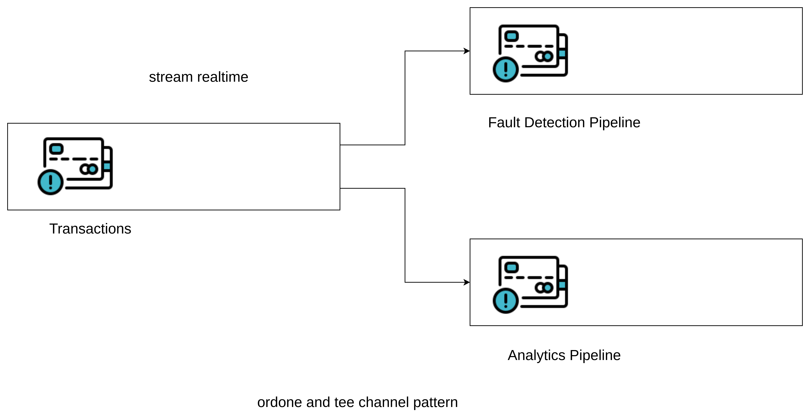

# golang-or-done-and-tee-channel-sample

This repository is for demo on or-done-and-tee pattern to handle concurrency workflow with graceful shutdown

## Concept



## sample code
```golang
package main

import (
	"fmt"
	"math/rand"
	"time"
)

// orDone merges a done channel with the input channel
func orDone(done <-chan struct{}, input <-chan int) <-chan int {
	out := make(chan int)

	go func() {
		defer close(out)
		for {
			select {
			case <-done:
				return
			case v, ok := <-input:
				if !ok {
					return
				}
				select {
				case out <- v:
				case <-done:
				}
			}
		}
	}()
	return out
}

// tee splits an input channel into two separate output channels
func tee(input <-chan int) (<-chan int, <-chan int) {
	out1 := make(chan int)
	out2 := make(chan int)
	go func() {
		defer close(out1)
		defer close(out2)
		for v := range input {
			select {
			case out1 <- v:
			case out2 <- v:
			}
		}
	}()
	return out1, out2
}

// transactionGenerator simulates real-time transaction data
func transactionGenerator(done <-chan struct{}) <-chan int {
	out := make(chan int)
	go func() {
		defer close(out)
		for i := 0; i < 200; i++ {
			select {
			case <-done:
				fmt.Println("Transaction Generator: Shutting down")
				return
			case out <- rand.Intn(1000): //random transaction amount
				time.Sleep(time.Millisecond * 100) // simulate delay
			}
		}
	}()
	return out
}

func fraudDetectionPipeline(done <-chan struct{}, input <-chan int) {
	for transaction := range orDone(done, input) {
		if transaction > 700 { // Example condition for "suspicious" activity
			fmt.Println("Fraud Detection: Suspicious transaction detected:", transaction)
		} else {
			fmt.Println("Fraud Detection:  Normal transaction:", transaction)
		}
	}
}

func analyticsPipeline(done <-chan struct{}, input <-chan int) {
	total := 0
	count := 0
	for transaction := range orDone(done, input) {
		fmt.Println("Analytics: Processing transaction:", transaction)
		total += transaction
		count++
	}
	if count > 0 {
		fmt.Printf("Analytics: Average transaction amount: %d\n", total/count)
	}
	fmt.Println("Analytics Pipeline shutdown")
}
func main() {
	done := make(chan struct{}) // signal to stop processing

	// Generate transactions and split them for both pipelines
	source := transactionGenerator(done)
	fraudCh, analyticsCh := tee(source)
	// Run pipelines councurrently
	go fraudDetectionPipeline(done, fraudCh)
	go analyticsPipeline(done, analyticsCh)
	// Simulate a cancellation after 10 seconds
	time.Sleep(10 * time.Second)
	close(done)

	// Allow time for pipelines to wrap up
	time.Sleep(1 * time.Second)
	fmt.Println("Main: All pipelines stopped")
}
```